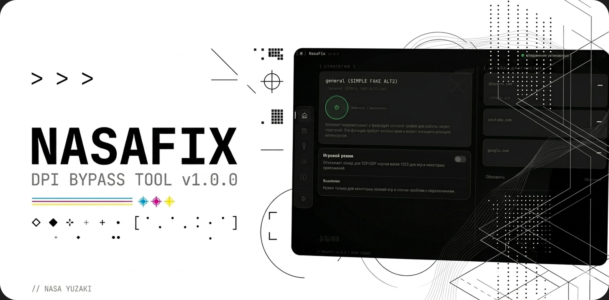
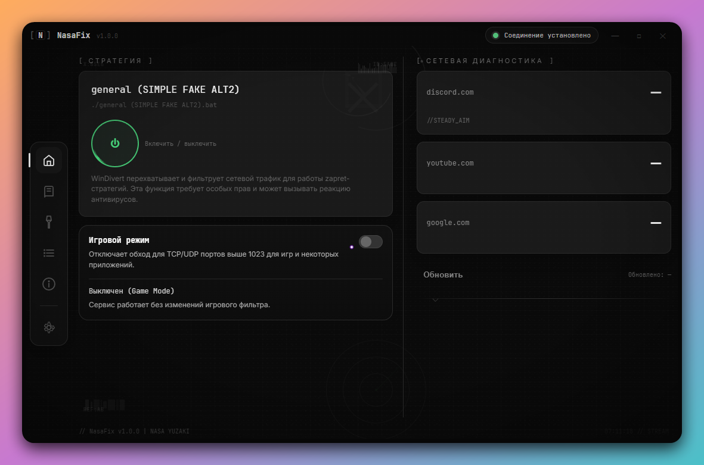
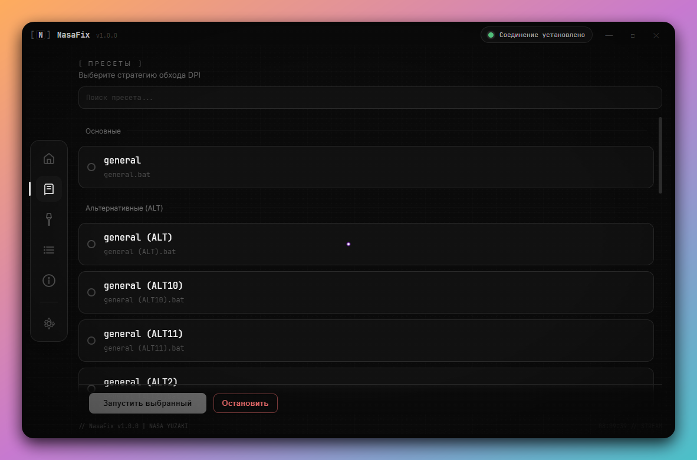
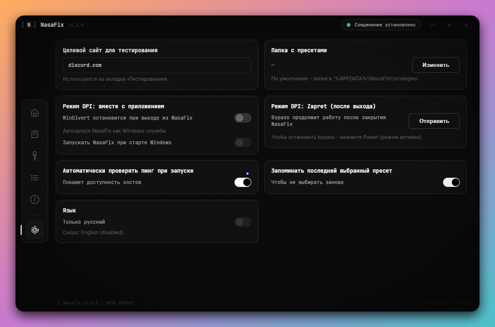
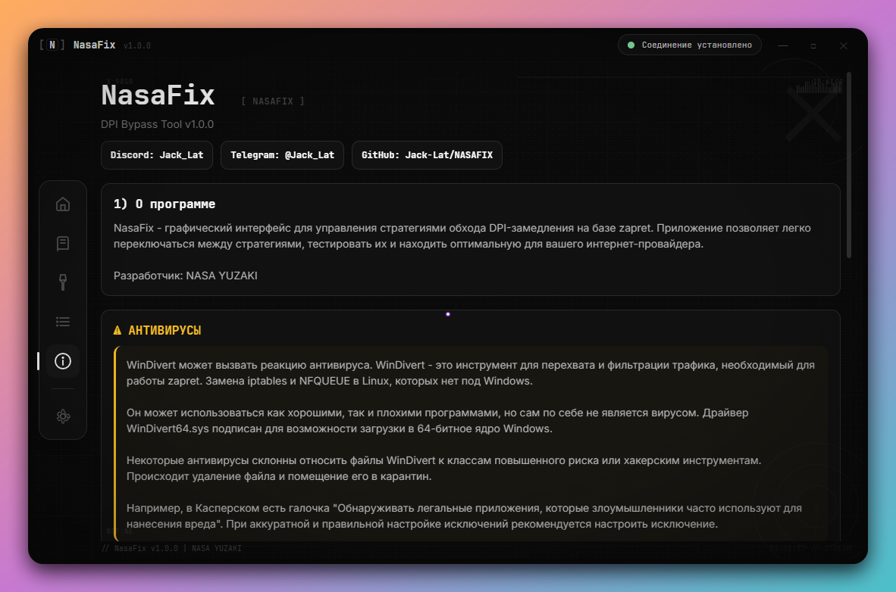

  
    
  
  <h1>NasaFIX</h1>
  
  
<strong>Сервис для управления стратегиями обхода DPI на базе <a href="https://github.com/bol-van/zapret">zapret</a></strong>

  
Тестируйте, выбирайте и запускайте оптимальную стратегию для вашего провайдера — в один клик.

  

  
  

    
  

  
  

  <a href="#-установка">📥 Скачать</a> ·
  <a href="#-быстрый-старт">⚡ Быстрый старт</a> ·
  <a href="#-возможности">📖 Возможности</a> ·
  <a href="#-частые-вопросы">❓ FAQ</a> ·
  <a href="#-лицензия">📜 Лицензия</a>

 

> [!NOTE]
> 🆕 **Ускорение Telegram Desktop** — [Flowseal/tg-ws-proxy](https://github.com/Flowseal/tg-ws-proxy)  
> 📦 **Альтернатива (без GUI)** — [bol-van/zapret-win-bundle](https://github.com/bol-van/zapret-win-bundle)

 

## 🖼️ Интерфейс

  
<b>Показать остальные скриншоты</b>

   

  

    <b>Стратегии</b> 
    Выбор и запуск пресетов обхода
      
    
  

   

  

    <b>Настройки</b> 
    Конфигурация режимов работы
      
    
  

   

  

    <b>О программе</b> 
    Информация, контакты и предупреждения
      
    
  

 

## 📥 Установка

1. **Настройте Secure DNS** (обязательно — без этого обход может не работать)
2. Скачайте установщик со страницы [последнего релиза](https://github.com/Jack-Lat/NasaFIX/releases/latest)
3. Запустите `NasaFix Setup 1.0.0.exe`
4. Готово

### 🔐 Настройка Secure DNS

<b>Google Chrome</b>

 

Настройки → Конфиденциальность и безопасность → Безопасность → **«Использовать безопасный DNS»** → выберите поставщика, отличного от провайдера по умолчанию.

<b>Mozilla Firefox</b>

 

Настройки → Конфиденциальность и защита → **«Включить DNS через HTTPS»** → Максимальная защита → «Выбрать поставщика» → укажите вручную, например:
`https://dns.google/dns-query`

<b>Windows 11 (рекомендуется)</b>

 

Параметры → Сеть и Интернет → Wi-Fi / Ethernet → Свойства → Назначение DNS-сервера → Изменить → «Вручную» → IPv4 → DNS: `8.8.8.8` → DNS через HTTPS: **Включено**.

 

## ⚡ Быстрый старт

1. Откройте вкладку **«Тестирование»** в боковой панели
2. Выберите сайт для проверки (Discord, YouTube и т.д.)
3. Выберите BAT-стратегии для тестирования
4. Нажмите **«Начать тестирование»** и дождитесь результатов
5. Нажмите **«Применить и запустить»** на рекомендуемой стратегии

> Также можно перейти на вкладку **«Стратегии»**, выбрать нужную вручную и нажать **«Запустить выбранный»**.

 

## 📖 Возможности

### Основные функции

| Функция              | Описание |
|----------------------|---------|
| **Автотест стратегий** | Автоматическая проверка всех BAT-стратегий на работоспособность |
| **Сетевая диагностика** | Проверка доступности discord.com, youtube.com и других сервисов |
| **Автозапуск**         | Установка любой стратегии как Windows-службы |
| **Game Filter**        | Режим для игр (обход UDP/TCP на портах выше 1023) |
| **IPSet Filter**       | Обход сервисов из `ipset-all.txt` |
| **Отправка логов**     | Диагностика и отправка логов для решения проблем |

### Статусы системы

| Статус                    | Значение |
|---------------------------|---------|
| 🟢 Соединение установлено | Система работает |
| ⚫ Неактивно              | Система отключена |
| 🔵 Тестирование           | Идёт проверка стратегий |
| 🔴 Ошибка сервиса         | Требуется перезапуск NasaFIX |

 

## 🛡️ Антивирусы

> [!WARNING]
> **WinDivert может вызвать реакцию антивируса.**

WinDivert — это легитимный инструмент для перехвата и фильтрации сетевого трафика (аналог `iptables` + `NFQUEUE` в Linux). Он необходим для работы zapret-стратегий.

Некоторые антивирусы (особенно Kaspersky, Avast, ESET) могут определять его как `Not-a-virus:RiskTool.Multi.WinDivert` или просто `WinDivert`.

**Что делать:**
- Добавить папку с NasaFIX в исключения антивируса (рекомендуется)
- Отключить проверку PUA (Potentially Unwanted Applications)

> [!IMPORTANT]
> Все бинарные файлы в папке `bin` взяты из официального репозитория [bol-van/zapret-win-bundle](https://github.com/bol-van/zapret-win-bundle). Вы можете проверить их по хэшам.

 

## ❓ Частые вопросы

<b>После запуска стратегии general* ничего не происходит</b>

 

Убедитесь, что в вкладке **«Тестирование»** статус стал **«Соединение установлено»**.
Если не помогает — напишите в Discord: `Jack_Lat` или Telegram: [@Jack_Lat](https://t.me/Jack_Lat)

<b>Не работает Telegram / бесконечное «подключение» в Discord</b>

 

1. Перезапустите NasaFIX
2. Обновите сборку, если предлагается
3. При необходимости положите актуальные стратегии в `AppData\Roaming\nasafix\strategies`

<b>Обход не работает или перестал работать</b>

 

Стратегии со временем могут "выгорать". Попробуйте создать новую стратегию на основе существующей. Документация по параметрам: [zapret readme](https://github.com/bol-van/zapret/blob/master/docs/readme.md#nfqws)

(остальные вопросы оставил как были, они в целом нормальные)

---

Хочешь, я могу сделать ещё более чистую версию (убрать некоторые детали, улучшить стиль, добавить эмодзи аккуратнее и т.д.). Скажи, в какую сторону править.

Также могу отдельно подготовить улучшенный промпт для баннера.
